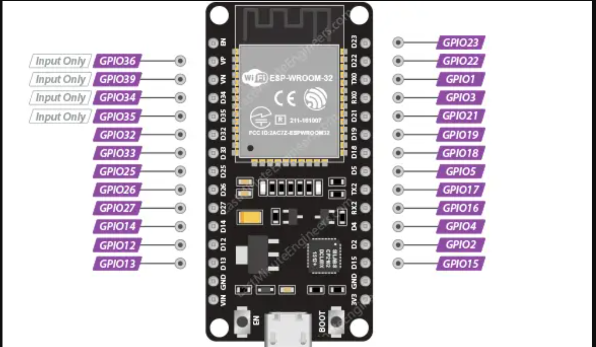

# ESP32 Marauder Wiring Cheat Sheet

This document provides a compact reference for wiring the ESP32-WROOM-32 board to the 2.8" ILI9341 TFT LCD Display.

## Wiring Table

| TFT/SD Pin | ESP32 GPIO |
| :--------- | :--------- |
| VCC        | 3.3V       |
| GND        | GND        |
| CS         | GPIO 17    |
| RESET      | GPIO 5     |
| D/C        | GPIO 16    |
| MOSI       | GPIO 23    |
| SCK        | GPIO 18    |
| LED        | GPIO 32    |
| MISO       | GPIO 19    |
| T_CLK      | GPIO 18    |
| T_CS       | GPIO 21    |
| T_DI       | GPIO 23    |
| T_DO       | GPIO 19    |
| SD_CS      | GPIO 12    |

## ESP32 Pin Map

## Troubleshooting

If display blank, check:
- VCC=3.3V not 5V
- Check GND
- Check MOSI/MISO/SCK/CS mapping
- Ensure SD card seating.
