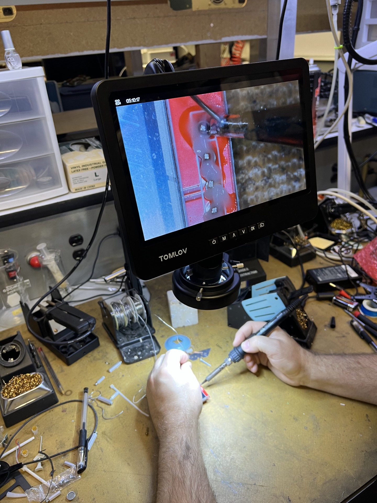
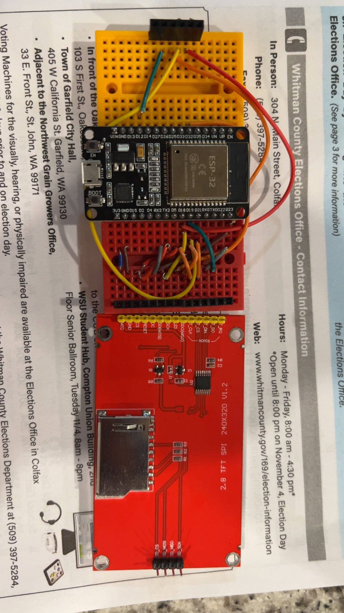
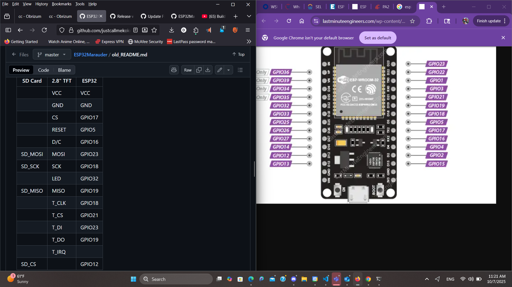

# ESP32 Marauder Progress Update

## Overview
- Successfully wired and flashed the ESP32 Marauder on a breadboard setup.
- Initial display issues were resolved after confirming proper SPI wiring and installing the correct CP210x USB-to-UART driver.
- All male header pins were soldered to ensure solid connectivity between the TFT and ESP32.

## Images & Progress

*Caption: First successful Marauder boot screen confirming firmware functionality.*

*Caption: Soldering process using magnification setup for precision.*

*Caption: Current breadboard wiring layout of the ESP32 and TFT screen.*

*Caption: Wiring reference used for SPI, TFT, and SD card connections.*

## Current Status
- ESP32 Marauder boots and menu navigation works as expected.
- TFT display is functional and receiving power from the ESP32.
- Preparing to integrate a **portable power solution** (rechargeable lithium battery pack) to make the unit self-contained for field use.

## Next Steps
- Add portable USB/LiPo battery to test standalone operation.
- Validate SD card detection and logging functions.
- Clean up wiring layout for consistency and minimize interference.
- Run functional tests for Wi-Fi and Bluetooth scanning features.

## Future Plans
- Finalize stable wiring diagram for replication and documentation.
- Transition setup from breadboard to soldered perfboard or PCB for reliability.
- Test and log performance metrics (boot time, scan accuracy, and SD write validation).
- Prepare short demonstration and technical summary for next review session.

## Next Meeting Goal
Ready for discussion with AJ at noon.
