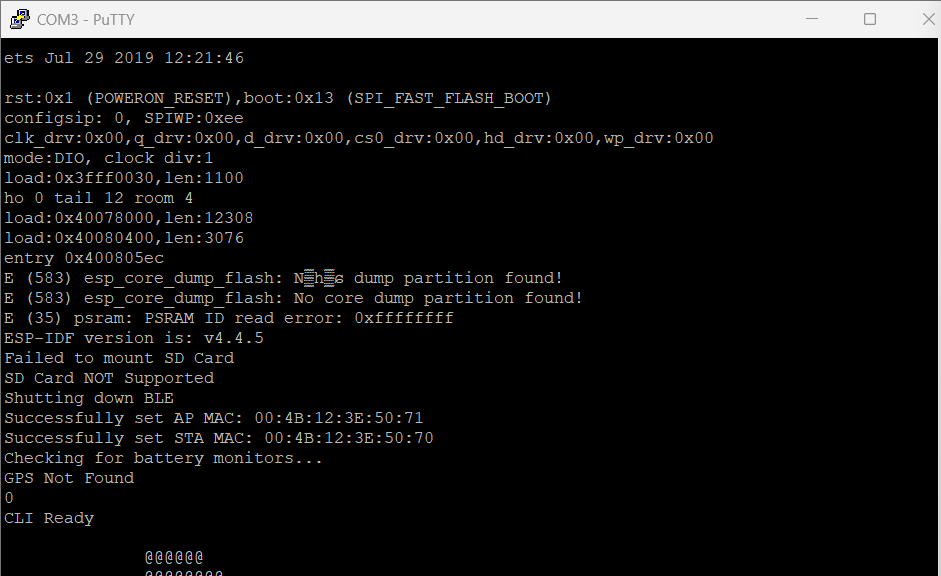

# Project Progress Update: Day 3 — ESP32 Marauder

**Date:** October 29, 2025
**Author:** Darasimi Ogunbinu-Peters
**Status:** **Blocked** — Awaiting correct hardware (microSD card).

---

### Summary

This update outlines the progress made on the ESP32 Marauder project and details a minor hardware roadblock. While all preliminary setup and testing tasks that can be performed without onboard storage are complete and successful, the next phase of packet capture is currently blocked. The issue stems from receiving a full-size SD card instead of the required microSD card for the Marauder's TFT module. My immediate plan is to acquire the correct microSD card to resume testing.

### The SD Card Issue

After coordinating with Michael last week, I received a spare SD card yesterday evening. My follow-up efforts included direct emails, messages on Microsoft Teams (his preferred contact method), and reaching out to the Cybersecurity Club for assistance.

Unfortunately, the provided card was a full-size SanDisk SDHC card inside an adapter, whereas the Marauder's TFT module requires a microSD card to be inserted directly into its slot. Because of the size mismatch, the device cannot make contact with the card's pins, resulting in an "SD Card NOT Supported" error on boot. This hardware incompatibility is the sole blocker preventing the project from moving into the packet capture and analysis phase.

For visual reference, the images below document the incorrect card type and the error message.

**
**

### Completed Work

In the meantime, I have successfully completed all other preparatory work to ensure the Marauder is ready for the next steps once the storage issue is resolved. This includes:

- **Verified Serial Communication:** Confirmed stable data connection between the ESP32 and the host machine.
- **Successful Wi-Fi Scans:** Executed AP and client scans to ensure the Wi-Fi module is functioning correctly.
- **Confirmed Marauder Boot:** The device boots successfully into the Marauder firmware without any issues (other than the SD card error).
- **Reviewed Packet Capture Commands:** Familiarized myself with the correct command syntax for initiating packet captures once the microSD is functional.

### Next Steps

1.  **Acquire Correct Hardware:** I plan to get a compatible microSDHC card (FAT32 formatted) immediately following today's meeting.
2.  **Continue Testing:** Once the correct card is installed, I will proceed with the packet capture portion of the project.
